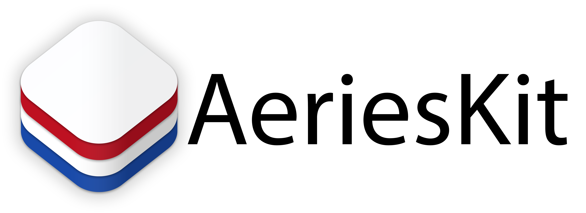

<!-- PROJECT LOGO -->
<br />
<div align="center">
  
  
  <picture>
      <source media="(prefers-color-scheme: dark)" srcset="Assets/Logo-Large-Dark.png">
      
  </picture>
  
</div>

# About

AeriesKit does not use the offical Aeries API and is not related. It works without needing an api key from your respective school district because it scrapes information off of the Aeries web portal. These functions are more important if you wish to create your own version of the dashboard.

If you have any problems or questions regarding AeriesKit, please open an issue.

# How to Use

## Swift Package Manager

To integrate using Apple's Swift Package Manager, add the following as a dependency to your Package.swift:

```swift
dependencies: [
    .package(url: "https://github.com/Opus-Aeries/AeriesKit.git", branch: "main")
]
```

Alternatively navigate to your Xcode project, select Swift Packages and click the + icon to search for AeriesKit.

# ⚠️ Disclaimer
Any product names, logos, brands, and other trademarks or images featured or referred to within the Opus-Aeries organization (github.com/Opus-Aeries) and/or on any social media forum are the property of their respective trademark holders.  These trademark holders are not affiliated with Opus-Aeries or it's website. These trademark holders do not sponsor or endorse Opus-Aeries or any of it's products or comments.

Further, Opus-Aeries declares no affiliation, sponsorship, nor any partnerships with any registered trademarks unless otherwise stated.

Should you have any questions or concerns please contact us.
